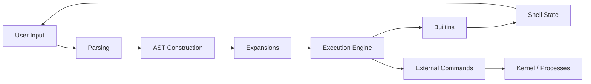
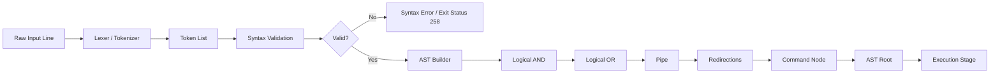
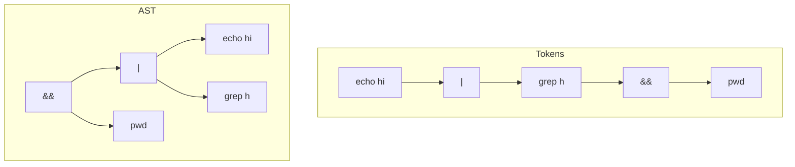

# Minishell

A Unix shell implementation in C that reproduces core Bash behavior: parsing, expansion, pipelines, redirections, builtins, and process control.

Built for the 42 curriculum with a strong focus on systems programming and POSIX-style behavior.

## 42 Scope and Project Notes

- Implemented according to the 42 Minishell requirements.
- Bonus-level features are integrated directly in `src/` (no separate bonus target).
- Current feature set includes logical operators and grouped/subshell execution.

## Features

- **Prompt & loop**: interactive shell loop with clean exit handling
- **History**: command history via `readline`
- **Execution**: `PATH` resolution and process spawning using `execve`
- **Builtins**: `echo`, `cd`, `pwd`, `export`, `unset`, `env`, `exit`
- **Environment**: internal env representation synced to child process env arrays
- **Expansion**: `$VAR`, `$?`, quote-aware behavior, heredoc-aware expansion
- **Redirections**: `<`, `>`, `>>`, `<<` with file descriptor control
- **Pipelines**: multi-process pipe execution with proper exit status propagation
- **Signals**: interactive and child signal handling behavior
- **Logical operators**: `&&`, `||`, and grouped execution via AST/subshell nodes

## Architecture

The shell is organized as a staged pipeline from input to execution:

- `parsing/`: lexer and syntax validation
- `ast_tree/`: AST construction and cleanup
- `expansions/`: variable, quote, wildcard, and heredoc-related expansion
- `execution/`: command/binary execution, pipes, redirections, subshells
- `builtins/`: builtin command implementations
- `main_functions/`: initialization, loop control, signals, errors
- `wildcard/`: wildcard matching logic
- `libft/`: shared utility functions

### High-Level Architecture


### Input to Execution Flow



### Token to AST Transformation



### Token to AST Example

Input: `echo hi | grep h && pwd`



## Build

```bash
make
```

Cleanup:

```bash
make clean
make fclean
make re
```

Binary:

- `./minishell`

## Run

```bash
./minishell
```

## Demo

```bash
$ echo hello | wc -c
6

$ export NAME=world
$ echo "hello $NAME"
hello world

$ false && echo nope || echo works
works
```

## macOS Note

The Makefile supports Homebrew `readline` on macOS:

```bash
brew install readline
```

## Portfolio Highlights

- Built an AST-driven shell interpreter with operator precedence handling
- Implemented process orchestration using `fork`, `execve`, `waitpid`, `dup2`, and pipes
- Designed explicit FD lifecycle handling across redirections and pipelines
- Reproduced core shell behavior for expansion, signals, and builtin state management
